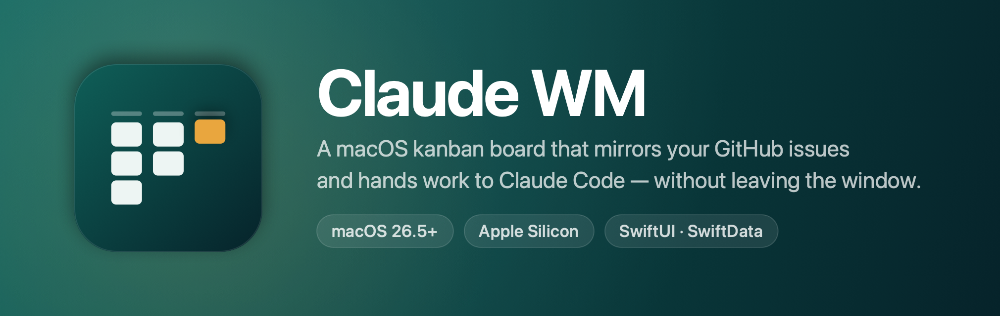
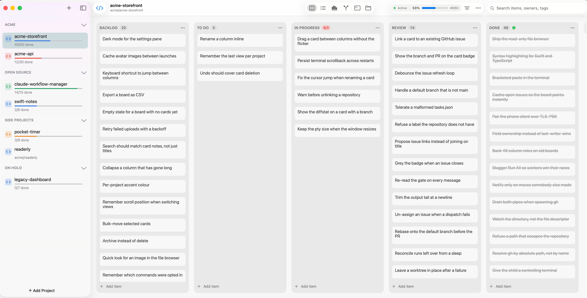

<p align="center">
  
</p>

<p align="center">
  <a href="https://github.com/kmrifat/claude-workflow-manager/releases/latest"></a>
  
  
  
</p>

**Claude WM** is a kanban board for the projects you actually work on. Point a
board at a Git clone and the window fills in around it: that repository's open
GitHub issues, a real terminal, a file browser — and a card you can hand to
Claude Code, then watch move itself to *In Progress* and on to *Review* with a
branch and a PR attached.

Everything is local. There is no account, no server and no telemetry; your
GitHub auth is whatever `gh` already holds, and the app never sees a token.

<p align="center">
  
</p>

---

## Install

### Download the app

No Xcode, no build. **[Download the latest release][latest]**, open
`ClaudeWM-1.0-arm64.dmg`, and drag **Claude WM** into your Applications folder.

[latest]: https://github.com/kmrifat/claude-workflow-manager/releases/latest

> [!IMPORTANT]
> **The first launch will be refused, and that is expected.** These builds are
> ad-hoc signed rather than notarized, so macOS blocks them until you say
> otherwise. Open **System Settings ▸ Privacy & Security**, scroll to the
> bottom, and click **Open Anyway** next to the message about Claude WM. Then
> open the app again. One command does the same thing:
>
> ```bash
> xattr -dr com.apple.quarantine "/Applications/Claude WM.app"
> ```

### What you need

| | |
|---|---|
| **macOS 26.5 or later** | Required. The app will not launch on anything older. |
| **Apple Silicon** | The released build is arm64 only; it does not run on Intel Macs. |
| [`gh`](https://cli.github.com) | Only for the **Issues** view. Install it, then run `gh auth login`. |
| [`claude`](https://claude.com/claude-code) | Only for the Claude features. npm, nvm, bun and volta installs are all found automatically. |

Nothing but macOS is needed to open the app and use a board — the rest light up
the features that depend on them.

---

## Getting started

**1. Make a project.** Click **＋ Add Project** at the foot of the sidebar. You get a board with the
default columns straight away; drag cards between them, and ⌘Z undoes anything.
A project needs no repository at all if all you want is a board.

**2. Link a repository** to unlock the rest. Open the **⋯** menu in the
toolbar ▸ **Link Repository…**, which drops you in the Issues view to pick a
local Git clone. Issues, Terminal and Files all appear once it is linked.

**3. Switch views** from the toolbar, or with **⌥⌘1–6**:

| | View | What it is |
|---|---|---|
| ⌥⌘1 | **Board** | Kanban columns. Drag to reorder, click a card for its details. |
| ⌥⌘2 | **List** | The same items as a sortable table. |
| ⌥⌘3 | **Timeline** | Items laid out across their dates. |
| ⌥⌘4 | **Issues** | The repository's open GitHub issues, via `gh`. |
| ⌥⌘5 | **Terminal** | Real interactive shells, and saved commands you can re-run. |
| ⌥⌘6 | **Files** | A read-only browser of the working copy, syntax highlighted. |

**4. Try the terminal.** Open **Terminal** and hit **＋**. That is a real login
shell in your repository — your prompt, your history, `cd` that sticks, Ctrl-C
that actually interrupts. Save the commands you run constantly (`npm run dev`,
`swift test`) and **Run All** starts them together.

**5. Hand a card to Claude.** Turn on **Sync Board with Claude** in that same
**⋯** menu, then open a card and choose **Send to Claude**. The board is
mirrored into `.taskboard/tasks.json`; a `claude` session in that repository
picks the card up, sets it to *In Progress* when it starts, and moves it to
*Review* with the branch and PR URL when it opens one.

This one is opt-in and off by default for a reason: switching it on means
writing a file into your repository and letting an agent move your cards.

**6. Use it from your phone**, if you want to. **Phone Access…** starts a
LAN-only server and shows a QR code; the iOS client pairs by scanning it. The
board, the terminal and the file browser are three separate switches, because
showing somebody your board should not also hand them a shell.

Stuck anywhere? The app carries its own guide — **Help ▸ Claude WM Help**, or
just **⌘?**.

---

## What's in this repository

Two unrelated products, sharing no code, no build system and no Swift language
mode. Neither depends on the other.

| | Lives in | Is |
|---|---|---|
| **Claude WM** | `workflow-manager.xcodeproj`, `workflow-manager/` | The macOS app above: kanban board, GitHub issue mirror, real terminal, file browser, iOS client. |
| **WorkflowHost** | `Package.swift`, `Packages/`, `Apps/` | A headless daemon that polls GitHub, serves a dashboard, and can dispatch Claude Code runs across repos. |

Both reach GitHub, and deliberately do it differently: the app shells out to
`gh`, which already holds your auth, so it never handles a token; the host uses
`URLSession` with a PAT because it runs headless and needs Projects v2 over
GraphQL.

`CLAUDE.md` is the working document — it records *why* things are built the way
they are, including a number of constraints that only show up when you get them
wrong.

---

## Claude WM in detail

### Cards

Cards carry priority, owner, dates, tags, Markdown notes and a subtask
checklist. A card can be **blocked by** other cards — the picker refuses to
create a cycle — and a blocked card can't be handed to an agent.

### GitHub

Issues are **cached but never owned**. Columns are `Unclaimed` / `Claimed`,
derived from assignment on GitHub — the real cross-machine lock — rather than
invented board columns. State flows GitHub → app, with exactly one exception:
"Create GitHub Issue…" files a board card as a *new* issue, showing you the
title, body and labels first. Nothing in the app can edit, close, assign or
comment on an issue that already exists.

Linking a card to an issue is always explicit. Titles are matched only to
*propose* a link for confirmation — never as the ongoing join, because a rename
on either side would silently repoint the card.

### Terminal

A real terminal, not a log view: each session is a persistent interactive login
shell on a pty, so `oh-my-zsh` draws its own prompt, history and arrow keys
work, `cd` persists, Ctrl-C interrupts, and `vim` and `htop` run on the
alternate screen. A saved command isn't a special kind of process — the session
starts a shell and *types* the command into it, so you can interrupt it and keep
using the shell afterwards. **Run All** starts everything you've opted in,
staggered so a worker doesn't lose the race with the server it talks to.

Sessions are owned by the project, not the tab: switching views or projects
leaves them running.

### Board sync with Claude

Opt-in per project, off by default — enabling it means writing into your
repository and letting an agent move your cards.

Turn on **Sync Board with Claude** and the board is mirrored into
`.taskboard/tasks.json`, which a Claude Code session reads and writes. **Send to
Claude** flags a card as requested; the session picks it up, reports
`in_progress` when it starts and `review` with a branch and PR URL when it opens
one.

Conflicts are resolved by **field ownership**, not last-writer-wins: Claude owns
`status`, `branch` and `prUrl`; the app owns `title`, `details`, `githubIssue`
and `requested`. Everything the agent writes is treated as untrusted — malformed
JSON keeps the last good board rather than clearing it.

### Build from source

You need **Xcode 26**. Then:

```bash
xcodebuild -project workflow-manager.xcodeproj -scheme workflow-manager -destination 'platform=macOS' -derivedDataPath .xcbuild build
```

Or open `workflow-manager.xcodeproj` and hit run. The product is
`Claude WM.app`; the Xcode target and source folder are still named
`workflow-manager`, which is deliberate — see `CLAUDE.md`.

**The app is not sandboxed**, and can't be. A sandboxed process cannot launch an
arbitrary binary, and the whole GitHub integration is built on spawning `gh`.
That rules out the Mac App Store, which is a trade this repo makes knowingly.

---

## WorkflowHost (the daemon)

Progress across several products otherwise has to be reconstructed from session
transcripts and commit logs. WorkflowHost decides what runs next and shows where
everything stands.

Each person runs their own host on their own Mac, under their own Claude
subscription. **There is no shared server** — teammates see each other's
progress through GitHub, and issue assignment is the cross-machine lock.

### Requirements

- macOS 15 or later, Swift 6.1+
- `git`, `gh`, `claude`, and `cloudflared` for `--tunnel`
- A **fine-grained PAT with repo + project scope**, in the login Keychain.
  Projects v2 needs the project scope; a token without it authenticates fine and
  then fails only on the board query. `gh auth token` is *not* a substitute —
  its default scopes omit projects.

```bash
security add-generic-password -U -s dev.workflowhost -a github-token -w
```

The host only ever reads that token. It never writes, prompts for, or logs one.

### Configure

`~/Library/Application Support/WorkflowHost/config.json`. Running the host with
no config prints a template and writes nothing — a daemon shouldn't create files
nobody asked for.

```json
{
  "maxConcurrentPerRepo": 1,
  "pollIntervalSec": 60,
  "repos": [
    {
      "owner": "kmrifat",
      "name": "claude-workflow-manager",
      "path": "/Users/you/code/claude-workflow-manager",
      "projectNumber": 1,
      "readyColumn": "Ready",
      "activeColumn": "In Progress",
      "reviewColumn": "In Review"
    }
  ]
}
```

Bad config fails at boot naming the offending field and exits **78**
(`EX_CONFIG`), so launchd and CI can tell "misconfigured" from "crashed".

### Run

```bash
swift build
```

```bash
swift test
```

```bash
swift run WorkflowHost
```

Loads the config, opens the database and prints what it found.

```bash
swift run WorkflowHost poll --once
```

```bash
swift run WorkflowHost ready
```

```bash
swift run WorkflowHost serve
```

Polls continuously and serves the dashboard on `127.0.0.1:8420`. Add `--tunnel`
to expose it through a `cloudflared` quick tunnel — that's how the phone is
served, rather than a native iOS client. The dashboard token is printed exactly
once at startup and otherwise only lives in the Keychain.

```bash
swift run HostApp
```

The macOS menu bar client.

`WORKFLOWHOST_HOME` relocates the whole data directory — use it for tests, or to
run a second instance against a scratch database while the real one is live.

### The dispatcher

`serve --dispatch` is the only thing in the host that writes to GitHub. It
assigns issues, pushes branches, opens PRs and moves board cards. Everything
else — the poller, the dashboard — is read-only.

> **It has been written and unit-tested but never run against a real
> repository.** Point it at a repo you don't mind noise in, watch one issue go
> through, and only then raise `maxConcurrentPerRepo`.

Rules that exist for a reason:

- **Assignment is the lock.** The issue is assigned on GitHub first and alone,
  before any local work. Two hosts share no state; the second one sees the claim
  and skips. A failed dispatch un-assigns.
- **The area lock** keeps two runs out of one module. Worktrees isolate files,
  not meaning — two runs in the same area produce conflicting PRs that each look
  fine alone.
- **Nothing merges.** Every run ends at "PR opened" and waits for a human.

---

## Layout

```
workflow-manager.xcodeproj                     the app
workflow-manager/                              its source; Xcode-synchronized group
Package.swift                                  the host's root manifest
Packages/WorkflowCore/                         models + DTOs, no I/O, no dependencies
Packages/WorkflowHost/…/WorkflowHostKit/       all daemon logic (testable)
Packages/WorkflowHost/…/WorkflowHost/          main.swift, ~10 lines, forever
Apps/HostApp/                                  macOS menu bar client
```

`WorkflowCore` is the point of writing the host in Swift: change a DTO once and
every target fails to compile until it's fixed.

## Status

Both products are built and in use. What remains for the host is operational
rather than constructional — run the poller against a real project board, then
try a single dispatch.

Deliberately not built: a native iOS client (the tunnel serves a browser
instead), and GitHub OAuth for the dashboard (the token path is sufficient for a
single user).

Deliberately never to be built: a shared backend, a user table, or a sync
server. GitHub is the sync layer.

## Contributing

Read `CLAUDE.md` first. It's short, and most of it is the reasoning behind
decisions that look arbitrary until you know why — the concurrency rule, why
issues are cached as one blob, why the terminal forks instead of spawning, and
why the two products must never take a dependency on each other.
